# Infrastructure Issue Pattern Detection Workflow

A systematic decision framework for answering one question fast: **is this support ticket an isolated customer problem, or the visible symptom of a systemic infrastructure failure across a whole cluster, pod, or shard?**

A customer can't export their data — is their config wrong, or is the database cluster degraded? A user can't log in — is their SSO misconfigured, or is the auth service down for everyone on that node? This workflow answers that in **~2 minutes**, before anyone spends two hours troubleshooting the wrong layer.

**Core principle:** before investigating ticket details, check whether the infrastructure node is broken.

---

## What this is (and isn't)

This is a **diagnostic decision framework** — a repeatable process designed to be run by a support engineer (or an agent against a ticketing system), not a standalone application. It defines exactly how to detect a systemic pattern, what thresholds separate "coincidence" from "incident," and how to route the escalation.

**Covers:** historical ticket pattern detection across clustered infrastructure, systemic-failure identification, severity assessment (isolated vs. infrastructure-level), escalation routing, and trend tracking.

**Out of scope (by design):** root-cause investigation, fix validation, and capacity planning — these happen *after* the pattern question is settled.

---

## The workflow at a glance

> If the diagram doesn't render above, [view it directly here](infrastructure_pattern_detection_workflow.svg).

A five-step process:

1. **Identify the infrastructure node** — extract and normalize which pod, shard, cluster, or server the ticket belongs to (`POD-5`, `CLUSTER-us-east-1`, `SHARD-12`). If it's unclear, ask — never guess the assignment.
2. **Define the search window** — default 90 days; expand to 180 only when results are sparse.
3. **Search historical tickets** — two parallel queries (exact node identifier + keyword variants), deduplicated, newest-first, with the current ticket excluded to avoid self-reference.
4. **Categorize issues** — classify each ticket into a standard failure type (query/retrieval, write/mutation, delivery, auth, performance, sync, etc.) to expose clustering.
5. **Build the pattern assessment** — synthesize into a risk flag, a category-frequency breakdown, and a concrete recommendation.

---

## The decision that drives it: risk thresholds

The judgment lives in these thresholds — tuned to catch real incidents without firing on every two-ticket coincidence:

| Condition | Flag | Action |
|---|---|---|
| 3+ tickets, same category, within 30 days | 🔴 **Systemic** | Escalate to Engineering immediately, file an incident, skip customer-config investigation |
| 3+ tickets, same category, within 90 days | 🟡 **Pattern detected** | Open a tracking ticket, monitor, keep supporting the customer in parallel |
| 2 tickets, same category, within 30 days | 🟠 **Possible pattern** | Cross-check root causes; escalate if they match |
| No repeated categories | 🟢 **Isolated** | Proceed with standard investigation |

Three refinements keep it honest: **self-exclusion** (don't count the ticket you're investigating), **multi-product separation** (a query failure in Product A and Product B may be unrelated), and **time decay** (3 failures in 30 days is more urgent than 6 spread over 180 — slope matters).

---

## Why I built it

In day-to-day support, the same infrastructure failures surface as a scatter of individual-looking tickets, and whether anyone connects them depends on who happens to pick them up. I built this to make that connection systematic — so a pattern gets caught early, the escalation arrives with linked evidence instead of a hunch, and one infrastructure fix closes every affected customer's ticket at once. It reflects how I think about support: pattern-first, escalation with context, and resolving the cause rather than re-solving the same symptom N times.

---

## Impact it's designed to move

| Metric | Target |
|---|---|
| Time to escalate a systemic issue | < 10 min |
| Tickets where redundant investigation is prevented | > 30% |
| Escalations that turn out to be genuinely systemic (signal quality) | > 70% |
| Customer tickets resolved per single incident fix (multiplier effect) | > 3 |

📄 **[Read the full workflow, decision tree, and worked scenarios →](infrastructure-pattern-detection-workflow.md)**

---

## Author

Built by **Praniti Giri** — Technical Support Engineer focused on API debugging, integrations, and customer-facing technical resolution.
